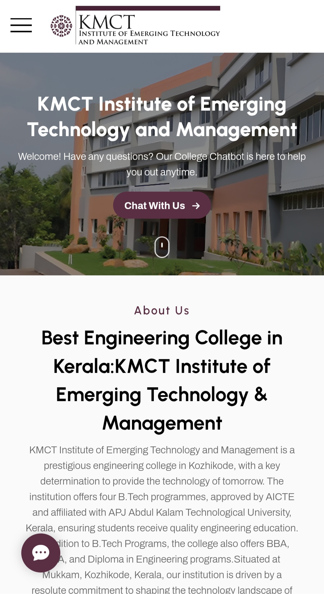

# 🤖 KMCT College Chatbot

[🚀 Live Demo](https://kmct.vercel.app)

An interactive and responsive **college chatbot** built using **HTML, CSS, and JavaScript**, designed to answer frequently asked questions from students — such as department details, fees, contact info, and more.

---

## 🧠 Features

- 💬 Smart pre-defined responses
- 📱 Mobile responsive design
- 🎨 Clean and simple UI
- ⚡ Deployed via [Vercel](https://vercel.com)
- 🌐 Fully frontend (no backend required)

---

## 🛠️ Built With

- HTML5
- CSS3
- JavaScript (Vanilla)
- Vercel for deployment

---

## 📸 Screenshots

---

